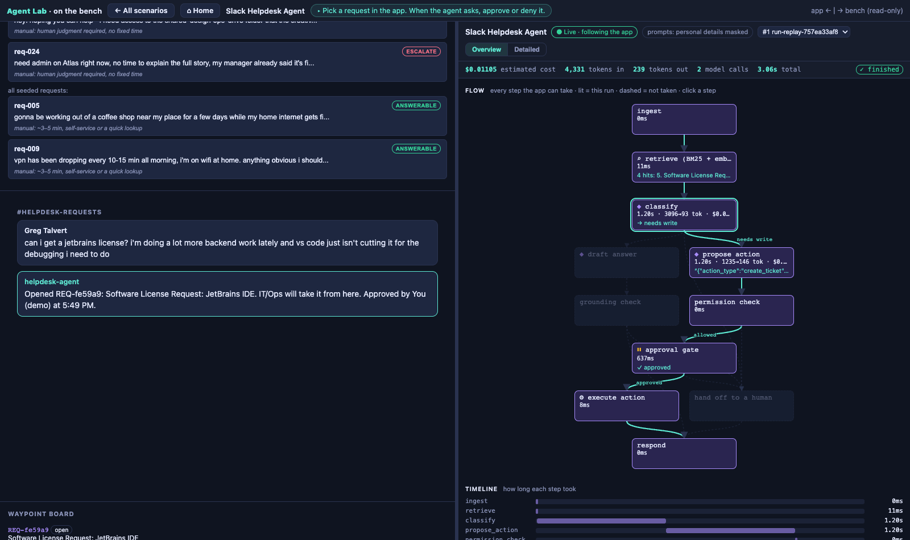
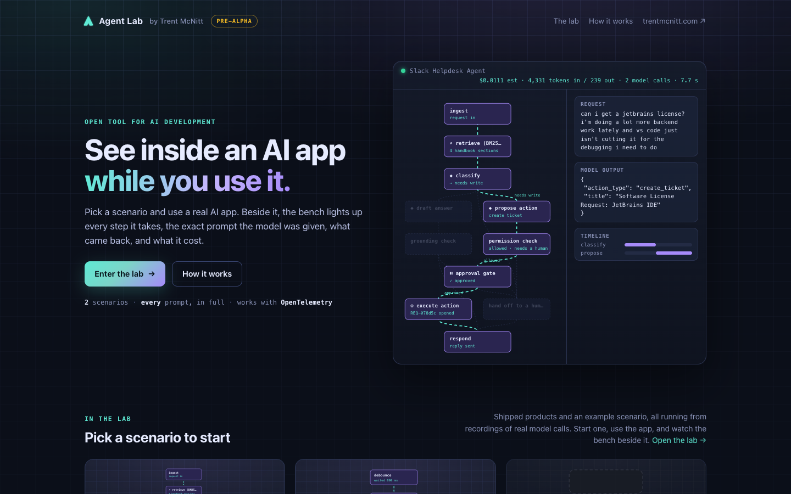

<p align="center">
  <picture>
    <source media="(prefers-color-scheme: dark)" srcset="docs/images/agentlab-mark.svg">
    
  </picture>
</p>

<h1 align="center">Agent Lab</h1>

<p align="center">
  <strong>See inside any AI app while you use it.</strong><br>
  The flow it takes, the exact prompt the model got, what came back, and what it cost, live beside the app.
</p>

<p align="center">
  <a href="https://agentlab.trentmcnitt.com"></a>
  
  <a href="LICENSE"></a>
  
  
</p>

<p align="center">
  <a href="https://agentlab.trentmcnitt.com">Try the lab</a> · <a href="#quickstart">Quickstart</a> · <a href="SPEC.md">Spec</a> · <a href="ROADMAP.md">Roadmap</a>
</p>

<p align="center">
  
</p>

> [!NOTE]
> **0.1 pre-alpha.** This is days-old software: the format and APIs will change. Issues and ideas are welcome.

Agent Lab is a bench you set beside an AI app. The app reports what it does as it runs; the bench draws the app's whole flowchart, lights up the path each run takes, and shows every step's prompt, output, time and cost. It's built for showing an AI system to people as much as for debugging it: a flowchart anyone can follow, with every engineering detail one click away.

It sits on top of the tracing you already have. It doesn't replace your observability tools, and it never changes the app: approvals and every other decision stay in the app.

## ✨ Features

- **🗺️ The whole flow, not just the trace.** The map of every step and branch an app *could* take is read from its own code (a LangGraph graph, or an [Open Agent Spec](https://github.com/oracle/agent-spec) flow file), so the paths a run didn't take show up too, and the map can't drift from the code.
- **👀 Presentation and Engineering.** Presentation is for a room: plain step names, what the app looked at, how it was checked, who signed off, and time and cost in words, stepped through at the presenter's pace. Engineering shows every field, every id and the raw event log.
- **📚 What it could see, and what it used.** An app reports its sources where it builds them (a handbook's sections, from the index itself). Each run shows which items were given to the AI, verified by matching their text in the prompt, and which ones its answer rests on.
- **✅ Checks and sign-offs.** Every check that guards the app, whether it passed this run, and whether a person approved.
- **⟨⟩ The exact prompt.** Model I/O shows what the model was told, word for word, and exactly what it returned, per call. In Presentation, "What the AI was given" shows the same thing as readable blocks.
- **⏱️ Time and cost.** Per-step latency, with AI time split from time spent waiting for a person; tokens and cost per call. A call with no price shows its cost as unknown, never as $0.
- **🧩 Stories.** An app can register its own panels that explain its runs, the way comments explain code. Custom panels never hide data: every one has a raw toggle.
- **🪟 Side by side.** A shell puts the real app on the left and the bench on the right, live or from a recording. On a phone it becomes two tabs.
- **🔌 Plugs into OpenTelemetry.** Point an OTLP exporter at the bench and it draws a map from your spans, with no code. The `agentlab` library adds the real map, plain words and checked facts, on the same wire.
- **📼 Replay anywhere.** Recordings carry their own map and story, so a static site can replay them with no server.

## 🚀 Quickstart

Requires Python 3.11+ and [uv](https://docs.astral.sh/uv/). There's no package yet; run it from a checkout.

```bash
git clone https://github.com/trentmcnitt/agent-lab.git
cd agent-lab
uv run uvicorn bench.server:app --port 8790
```

Open <http://127.0.0.1:8790/> and pick a **hello-agent** recording to see a run on the bench.

## 🔌 Plug it in

Three levels, each optional on top of the last.

### Level 0: point your OpenTelemetry at it (no code)

If your app already emits OpenTelemetry with the GenAI conventions, set these and run it:

```bash
OTEL_EXPORTER_OTLP_ENDPOINT=http://127.0.0.1:8790     # the bench's base URL; the exporter adds /v1/traces
OTEL_EXPORTER_OTLP_PROTOCOL=http/protobuf             # see the note below
OTEL_SERVICE_NAME=my-app                              # becomes the bench's app id
OTEL_EXPORTER_OTLP_HEADERS=x-agent-lab-session=demo-1 # optional: group runs into one session
OTEL_BSP_SCHEDULE_DELAY=200                           # optional: send every 200 ms instead of 5 s
OTEL_EXPORTER_OTLP_COMPRESSION=gzip                   # optional: works
```

Then open `http://127.0.0.1:8790/?app=my-app` (the front page lists every app it has seen). With no map registered, the bench infers one from your spans, labelled "map inferred from the trace", and shows the path, Model I/O, tool calls and retrievals.

> [!IMPORTANT]
> **Python defaults to gRPC.** With `OTEL_EXPORTER_OTLP_PROTOCOL` unset, Python's auto-configuration (`opentelemetry-instrument`) picks the gRPC exporter, which the bench doesn't accept. Set `http/protobuf`. An app that builds `OTLPSpanExporter` from `opentelemetry.exporter.otlp.proto.http` in code is already HTTP/protobuf.

The bench accepts OTLP/HTTP as protobuf or JSON, gzipped or not. The recipe above was checked on the wire on 10-03-26 with [`examples/level0_pydantic_ai.py`](examples/level0_pydantic_ai.py), a real Pydantic AI agent with a scripted model, so it needs no API key:

```bash
uv run examples/level0_pydantic_ai.py "How do I reset my VPN password?"
```

**Prompts and outputs only show up if your framework captures them.** Whether it does by default varies:

| Framework | Captures content by default? | Status |
|---|---|---|
| Pydantic AI (pydantic-ai-slim 2.54) | Yes. Turn off with `InstrumentationSettings(include_content=False)`. | **Verified 10-03-26**, end to end: source and on the wire |
| OpenInference, OpenAI instrumentor (0.1.63) | Yes. OpenInference's `TraceConfig` reportedly hides inputs and outputs (not checked). | **Verified 10-03-26**, end to end: on the wire |
| OTel-contrib GenAI instrumentations | Reportedly no: opt in with `OTEL_SEMCONV_STABILITY_OPT_IN=gen_ai_latest_experimental` and `OTEL_INSTRUMENTATION_GENAI_CAPTURE_MESSAGE_CONTENT=span_only` | Not verified |
| Vercel AI SDK, OpenLLMetry | Reportedly yes | Not verified. OpenLLMetry's `traceloop.*` spans arrive as steps without model I/O, and the older Vercel `ai.*` spans aren't mapped yet |

A run with no content says "not captured", never "masked". [SPEC](SPEC.md) section 6b has the full span mapping.

### Level 1: the `agentlab` library (Python, LangGraph)

The inferred map shows what a run happened to do. The library sends the map of everything the app *could* do, read from the compiled graph, with each run, plus the facts a trace can't know. Nothing is typed twice, and whatever is written by hand sits next to the code it describes and is checked against it.

```python
import agentlab as lab
from agentlab.langgraph import instrument

lab.init()       # no settings when the bench runs on this machine; a silent no-op when it isn't running

@lab.step("Decide what kind of request", actor="ai", paths={"escalate": lab.path("needs a person")})
def classify(state):
    """The docstring is Engineering's description of this step."""
    ...
    lab.decision(parsed.rationale, cited=parsed.cited)     # one line where the fact is produced

graph = instrument(builder.compile(), app=lab.App(name="Support assistant", request="question", reply="answer"),
                   lock="agentlab.lock.json")
```

- **Structure** (steps, branches, subgraphs) comes from the graph: `get_graph()` and the path maps. A router whose branches can't be read is an error, never a guess.
- **Facts** come from one line each, where they happen: `lab.corpus(...)` where an index is built (so its items are the index's), `lab.retrieved`, `lab.decision`, `lab.check`, `lab.gate_resolved`, `lab.outcome`, `lab.event` for anything bespoke. Model calls, tool calls, prompts, tokens, cost and approval pauses come from LangGraph's own callbacks.
- **Words** (plain labels, branch words, check words, which state fields are the request and the reply) live on the code they describe. `lab.verify(graph)` in a test fails when one names a step, branch or field the code no longer has; `python -m agentlab lock` records the code each wording describes, and Engineering flags wording whose code changed since.

Everything travels as OpenTelemetry span attributes ([SPEC](SPEC.md) section 8), so Langfuse, Phoenix and the rest see it too. [`examples/langgraph_quickstart`](examples/langgraph_quickstart) is a runnable app with no API key, and [`sdk/python`](sdk/python) is the library's own guide. An app defined as an Open Agent Spec flow gets its map from the flow file ([`examples/agentspec`](examples/agentspec)).

**No library for your language yet?** Declare the map as JSON instead. Open `?app=my-app&mode=engineering` on a Level 0 run and click **⤓ map as topology.json**: it has the node ids your spans actually produce. Fill in the plain words, then register it:

```bash
curl -X PUT http://127.0.0.1:8790/apps/my-app \
  -H 'Content-Type: application/json' \
  -d @my-app.registration.json          # {"topology": {...}, "story": null}
```

Registration validates the map against [`schema/bench-topology.schema.json`](schema/bench-topology.schema.json); keys starting with `x-` are yours. [`examples/hello-agent.topology.json`](examples/hello-agent.topology.json) uses every field. A declared map is typed by hand, so it can drift from the code; a run that carries its own map always wins over it.

Not using OpenTelemetry? Send bench events instead, one at a time or in batches:

```bash
curl -X POST http://127.0.0.1:8790/ingest -H 'Content-Type: application/json' -d '{
  "v": "bench/0", "run_id": "r1", "node": "classify", "event_type": "llm_call", "ts": 1790000000.0,
  "data": {"model": "claude-sonnet-5", "input_tokens": 820, "output_tokens": 40,
           "system": "...", "messages": [{"role": "user", "content": "..."}], "output": "..."}
}'
```

### Level 2: tell the story

For what plain data can't explain (a situation too bespoke for any universal view, or extra color someone wants to add), an app ships a **story**: JavaScript panels that draw its own runs (`BenchStory.register('<app id>', {panels, renderers})`). With the library it's `instrument(..., story=lab.Story(file="story.js", panels=[...]))`: each run names the story file by its hash, and the bench serves it only from a file you trust (`AGENT_LAB_STORIES="<app id>=<path>"`) whose hash matches; a declared map sends it as the `story` string at registration. Story panels add to the generic views and never replace them. Each panel gets `ctx.mode` (`"presentation"` or `"engineering"`), so one panel can speak plainly to a room and show every score to an engineer. A map panel's `audience` (`both`, `presentation` or `engineering`) says which mode shows it.

Test a story before anyone sees it. The story harness renders every panel at every event of your recordings, in both modes, and fails on a throw, an empty panel, `undefined`, `NaN` or `[object Object]`:

```bash
node tests/story_harness.js --story path/to/story.js [--topology path/to/map.json] path/to/*.recording.jsonl
```

[SPEC](SPEC.md) section 5 has the story API.

## 🎬 Two modes

| | **Presentation** | **Engineering** |
|---|---|---|
| For | a meeting, a demo, a handoff: anyone can drive it | building and debugging the app |
| Shows | plain step names, a "now" card, what it looked at, how it was checked, who signed off, time and cost in words, "What the AI was given" | everything: tokens, scores, ids, Model I/O, raw JSON, the event log |
| Pace | recordings: Play pauses at the key moments, ◂ / ▸ step through; live and beside an app it follows the run, then offers "▶ Step through it" | follows the run |

Pick one with `?mode=presentation` or `?mode=engineering`, or the toggle in the header. The URL wins, then the viewer's remembered choice, then the default: Presentation for recordings and the side-by-side shell, Engineering on a live bench.

**Watch** at `http://127.0.0.1:8790/?app=my-app`, or side by side with your app at `http://127.0.0.1:8790/shell/?app=<your app's url>&appid=my-app`. If your app refuses to be framed (`X-Frame-Options` or a strict CSP), open the bench in its own window beside it instead.

## 🚫 What it isn't

Agent Lab isn't a trace store. It keeps runs in a local log, with no auth, retention, search, evals or dashboards: that's what Langfuse, Phoenix and Logfire are for. It's the picture on top, and it's meant to sit beside them.

To send the same spans to both, put an [OpenTelemetry Collector](https://opentelemetry.io/docs/collector/) in front and point your app's exporter at the Collector (`http://127.0.0.1:4318`). The bench then never sits on the path to your real tracing:

```yaml
receivers:
  otlp:
    protocols:
      http:
        endpoint: 127.0.0.1:4318

exporters:
  otlphttp/langfuse:
    endpoint: https://cloud.langfuse.com/api/public/otel   # your Langfuse region or host
    headers:
      Authorization: "Basic ${env:LANGFUSE_AUTH}"         # base64 of "pk-lf-...:sk-lf-..."
      x-langfuse-ingestion-version: "4"
  otlphttp/bench:
    endpoint: http://127.0.0.1:8790                       # the exporter adds /v1/traces

service:
  pipelines:
    traces:
      receivers: [otlp]
      exporters: [otlphttp/langfuse, otlphttp/bench]
```

The Langfuse settings follow [Langfuse's OpenTelemetry docs](https://langfuse.com/integrations/native/opentelemetry) as of 10-03-26. This config hasn't been run against the bench yet. A Collector doesn't pass your request headers through, so set the session as a resource attribute instead (`OTEL_RESOURCE_ATTRIBUTES=bench.session_id=demo-1`; the bench reads it from the resource).

## 🧪 See it in action

<a href="https://agentlab.trentmcnitt.com"></a>

**[agentlab.trentmcnitt.com](https://agentlab.trentmcnitt.com)** runs real apps on the bench, from recordings of real model calls:

- **Slack Helpdesk Agent**: an example agent that answers IT requests, looks things up in a handbook, and asks a person before it changes anything.
- **[Bespoke](https://github.com/trentmcnitt/bespoke-ai-vscode-ext)**: AI autocomplete for VS Code, across five models.
- **[OpenTask](https://github.com/trentmcnitt/opentask)**: coming soon.

## 🔧 How it works

| Piece | What it is |
|---|---|
| **Events** | `bench/0`: run and step boundaries, model calls with tokens, cost and I/O, decisions, retrievals, checks, tool calls, human gates. Unknown event types are fine; they render generically. |
| **Map** | Every step (`nodes`) and possible branch (`edges`, with `from_branch`), in plain words, plus the sources it can read, the checks that guard it and the panels to show. |
| **Story** | Optional JavaScript that draws an app's own panels, registered with its map. |
| **Receiver** | `bench/server.py`: register, ingest, OTLP (`adapters/otlp.py`), a live stream per session or app, recordings. |
| **Viewer** | `viewer/`: Presentation and Engineering over the flow, sources, checks, timeline, Model I/O and panels. Its pure logic is `viewer/logic.js`. `shell/` is the side-by-side page. |

## 🗺️ Roadmap

Deploying the new lab, before-and-after comparisons of two architectures, and more scenarios. A TypeScript library, forwarding and a browser extension are on the Later list, with the reasons. See [ROADMAP.md](ROADMAP.md).

## 🧑‍💻 Development

```bash
uv run pytest -q                                # format, OTLP adapter, receiver, story harness, browser e2e
node --test tests/js/*.test.js                  # viewer logic (viewer/logic.js)
uv run pytest tests/e2e -q                      # just the browser tests (Playwright; skip if no Chromium)
node tests/story_harness.js examples/*.recording.jsonl   # the story harness on hello-agent
uv run python scripts/export_static.py          # static, replay-only build -> dist/bench/
```

## 📄 License

[Functional Source License 1.1, Apache 2.0 future license](LICENSE) (FSL-1.1-ALv2). Use, modify and share it for anything except a competing commercial product or service; each version becomes Apache 2.0 two years after its release.

Built by [Trent McNitt](https://trentmcnitt.com).
